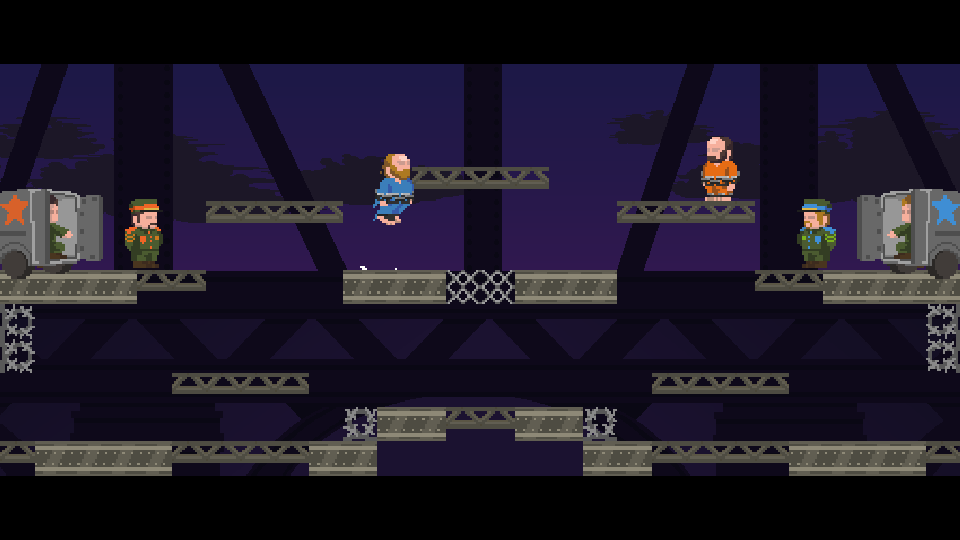

_During the cold war era, two enemy factions trade their prisoners: spies who were captured... Hands and legs tied down, prisoners must find their way through the exchange area, having their movement ability limited. They must read their ally faction, going as fast as they can... Indeed, the factions might not be as honest as you think..._

**itch.io**: [https://roilbauk.itch.io/betrayded](https://roilbauk.itch.io/betrayded)  
**Ludum Dare**: [https://ldjam.com/events/ludum-dare/44/betrayded/](https://ldjam.com/events/ludum-dare/44/betrayded/)

**Results: 12th** in Fun, **22nd** Overall.  
**Softwares and technologies:** Construct2, Aseprite, Ableton

BETRAYDED is a jam entry for the Ludum Dare #44, with our wonderful team of 6 people. The game is a two-player platformer and duel game. Reach your base, block your opponent and shoot him down!

In BETRAYDED, each player controls a prisoner who has been captured by the opposite faction. In order to set you free, both factions agreed on a prisoner exchange, therefore, you're thrown into the exchange area with the opposite prisoner, and your ultimate goal is to reach your home faction. But be quick! If the opponent reach his faction before, there are no reasons for them to let you reach yours that easily!
