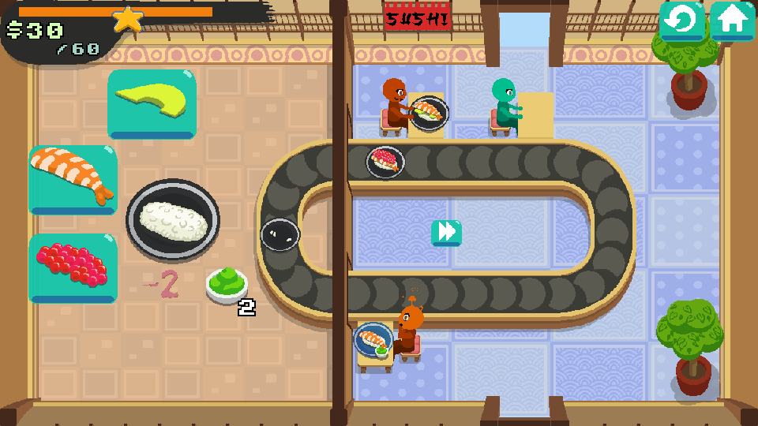

_What is better than regular sushis? GIANT sushis!_

_As the new sushi master in town, you have one job: satisfy your customers with the most delicious ingredient mix. They might have some precise tastes!_

**itch.io**: [https://zoglu.itch.io/giant-sushi-party](https://zoglu.itch.io/giant-sushi-party)  
**Ludum Dare**: [https://ldjam.com/events/ludum-dare/47/giant-sushi-party](https://ldjam.com/events/ludum-dare/47/giant-sushi-party)

In GIANT Sushi party, your goal is to earn money by creating the perfect sushi for your customers.

Stack up your ingredients, click on the plate and let the travelator do his office! But take care that you don’t run out of space, or your delicious plates might be… stuck in the loop!

This game was a special one for me as my main contribution for it was the music, and not the dev (singlely taken by [zoglu](http://zoglu.net/)).